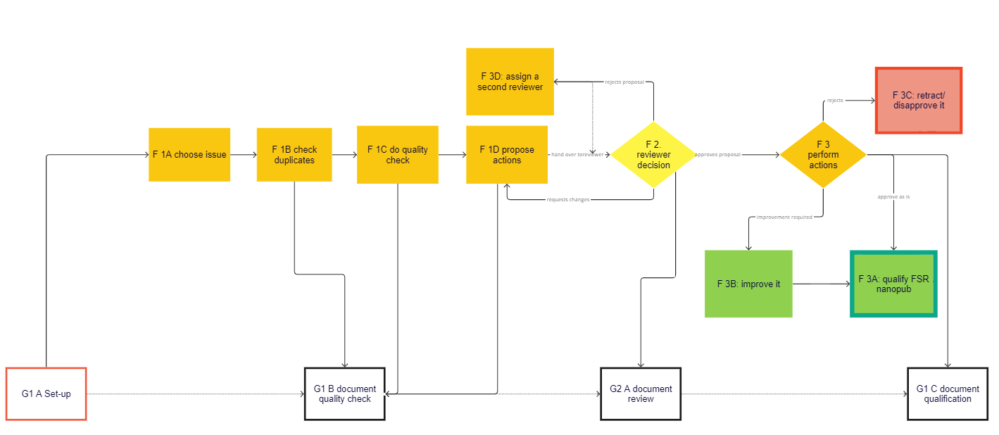
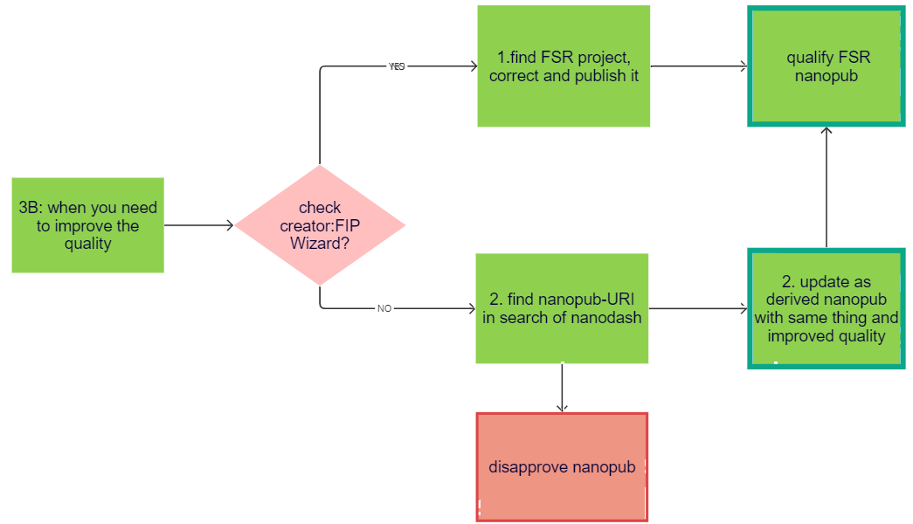
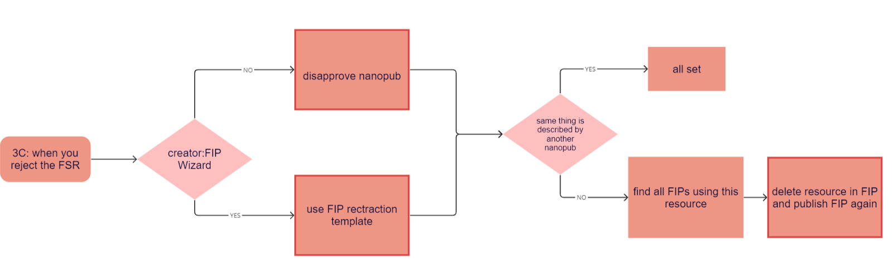
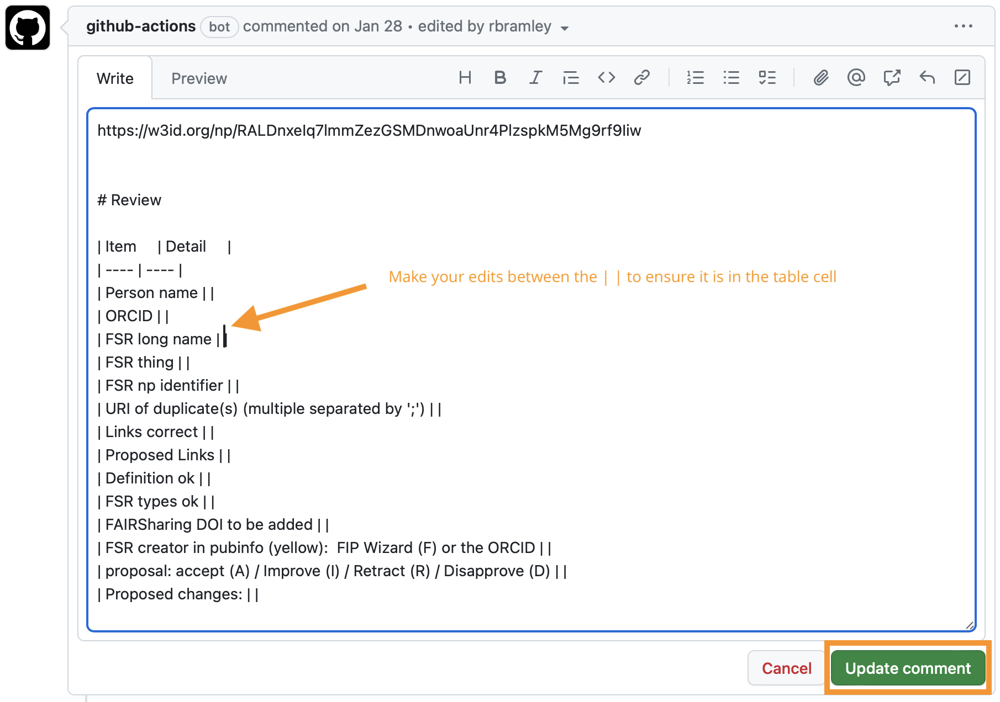
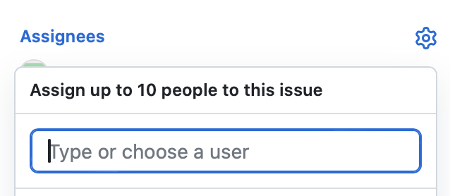
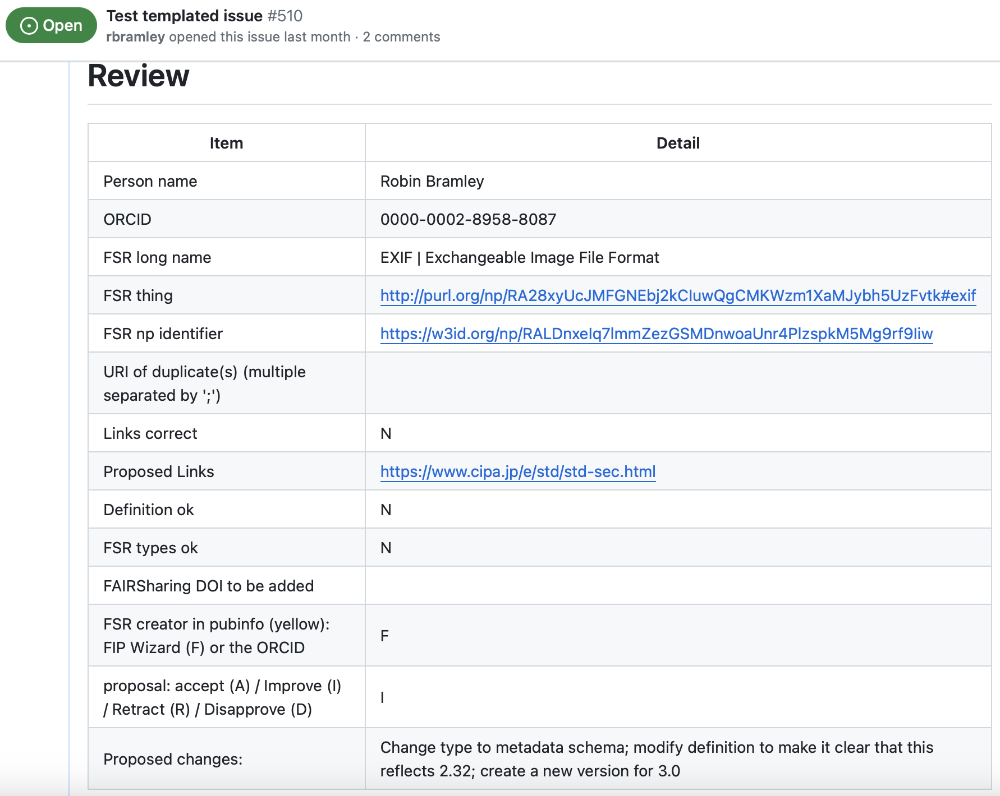
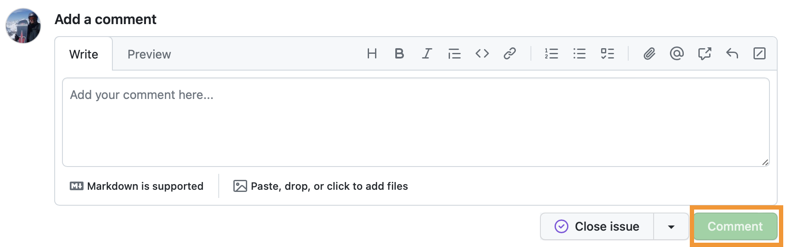
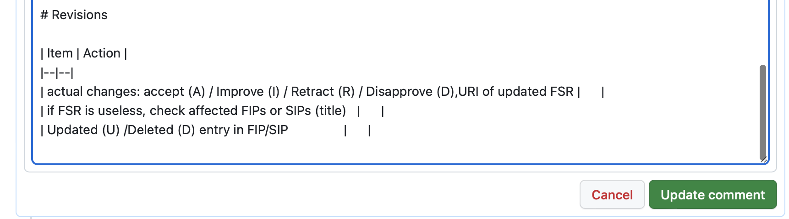
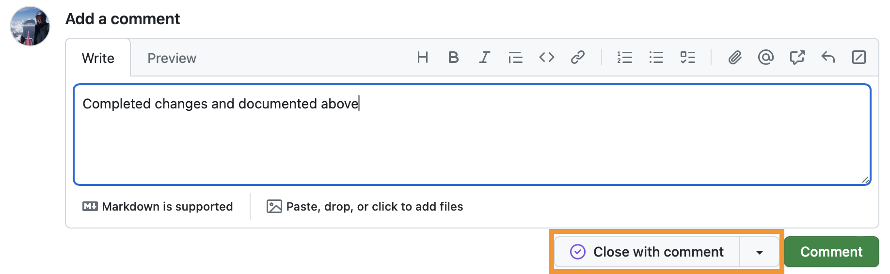
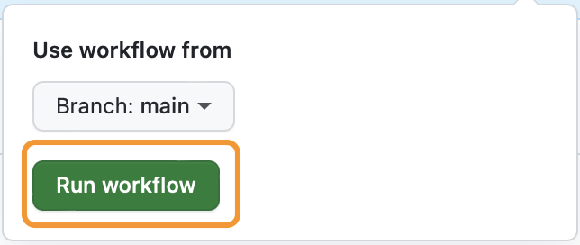

# **GFF Qualification workflow for FAIR Supporting Resources (FSR)**

## **Introduction**

Please be aware that only qualified FIP (or 3PFF) facilitators or trainers can participate in this process. Please check this [table ](https://docs.google.com/spreadsheets/d/1hLEimbWKdlyouIF4ZoerGG6mia58c98PsVQ8hIT4hqw/edit#gid=0)if your name is already registered. 

An FSR qualification process requires **two facilitators** to quality-check new FSR nanopubs. The first facilitator acts as editor and checks if there exist more than one nanopub for the same FSR and checks the quality for the best nanopub (usually the newest) while proposing to retract the duplicates. The editor will then propose if the FSR nanopub should be accepted as is, requires changes or should be retracted. The editor assigns a reviewer, preferably one with expertise related to the FSR type, to check the action proposal for the FSR. The reviewer can accept it, request changes or reject it. If the reviewer’s answer is positive, the editor can follow the actions proposed to finally qualify it. 

There are two main procedures to take into account:

1. the functional qualification process (F steps)
2. the documentation of the technical qualification process, which is handled via GitHub issues (G steps).

Both work together, as the 2) is included in the 1), documenting the actions in GitHub. 

## **Functional qualification process - F steps**

**Overall quality-control procedure:**

****

#### **GitHub Setup (only needed once) ->** [**G1 A Setup**](#g1-a-setup-steps) 

### **F1 As Editor**

A. Choose an issue from GitHub: https://github.com/gofair-foundation/fsr_qualification/issues - these issues are created by a [GitHub action](#appendix-b-refreshing-the-github-issues-list) which looks for unqualified FSRs in Nanodash.  
   These can be filtered by label (FSR type) from https://github.com/gofair-foundation/fsr_qualification/labels  
   Assign it to you (so that everybody can see that you are working on it)

B. Check for duplicates

1. Use the API: [check duplicates](https://peta-pico.github.io/tapas/tapas.html?api=peta-pico/dsw-nanopub-api&op=/find_gofair_qualified_things_x) by searching with the most common name (and similar names) of the FSR if there exists more than one nanopub.
2. The goal is to keep only the most informative nanopub, bear in mind that you should also check for the most frequently used resource in the FIPs/SIPs. Check their utilisation using the FSR thing URI within the [FSR in FIP/SIP API](https://github.com/peta-pico/dsw-nanopub-api/blob/main/tables/new_matrix_reduced.csv). However the most frequently used nanopub may need to be improved (as per the process in [F3B](#f-3b-proposal-accept-with-improvements) below).
3. Duplicates will need to retracted/disapproved (see [F3C](#f-3c-when-the-fsr-nanopub-should-be-retracted)) and any accompanying GitHub issues closed accordingly. Therefore it is essential that the same person(s) work on all duplicates of one resource.  

#### **Git Document Quality Check ->** [**G1 B**](#g1-b-steps-for-the-editor-to-document-the-quality-check)

C. Perform Quality check and document it in the GitHub issue table:

1. Add your name and ORCID

2. Add the FSR long name and the FSR thing URI

3. Add all URIs of duplicate(s) if they exist using the *Check Duplicates API*
  
4. check if the web links provided are working (add Y or N)
   
5. Propose new web links if needed
   
7. Check if the description is informative enough or if it needs to be corrected/improved (add Y or N)

8. Check if the allocated FSR types are all correct (add Y or N)
  
9. Check if the resource is described in FAIRsharing and if there exists a DOI. If so, then check if the nanopub already refers to it. In case the FAIRsharing does not refer to it, add it in the table. FAIRsharing has only a few types included, so no problem if you can’t find it.
  
11. If the FSR was created in the FIP/SIP wizard add F or S in the table, otherwise it was created in nanodash, so should add the ORCID of the creator. In addition, check if the `prov:wasDerivedFrom` in the pubinfo section of the nanopublication resolves to the correct FSR project in the wizard (see https://github.com/fip-wizard/fip-wizard/issues/1)

Finally,

D. Propose an action:

1. accept as is (A)
2. improve (I)
3. reject (Retract - R, or Disapprove - D)
   
      and assign a reviewer to check the proposal based on his/her expertise. If the reviewer doesn’t respond within 24 hours, check for another reviewer.

### **F 2 The Reviewer checks the proposal** 

and decides either to:

A. accept the proposal  
B. accept the proposal with some required changes  
C. reject the proposal

#### **Git Document Review ->** [**G2 A**](#g2-a-steps-for-the-reviewer)

### **F3 As Editor**

- if the proposal is accepted with changes, the editor negotiates with the reviewer and makes adjustments until both are satisfied;
- if the reviewer accepts the proposal: the editor proceeds with the proposed action:

A. proposal - accept as is: qualify the FSR nanopub with the [qualification nanopub template](https://nanodash.knowledgepixels.com/publish?55&template=https://w3id.org/np/RApEyTXPOt_h81Ao0WpzRhigcgvqrbnNBCo8fEpsZ6CxU)  
B. proposal - accept with improvements: proceed with the improvement (see below)  
C. proposal - reject: disapprove/retract the nanopub (see below).  
D. If the reviewer rejects your proposal, get another opinion. Follow the decision that has at least two supporters.

#### **F 3B: Proposal accept with improvements:**

Make sure to get in contact with the creator of the FSR nanopub before you change the metadata. If you can’t get any response write an email to the creator with your intended change or, in case you don’t have the email, inform about the change in a comment directly in the FIP Wizard FSR project. 

1. If the creator is the FIP Wizard 
   1. find the project, improve the metadata and publish a new nanopub
   2. qualify the FSR nanopub with the [qualification nanopub template](https://nanodash.knowledgepixels.com/publish?55&template=https://w3id.org/np/RApEyTXPOt_h81Ao0WpzRhigcgvqrbnNBCo8fEpsZ6CxU)

2. If the creator is documented via an ORCID (then you have to work with nanodash)
   1. search for the nanopub-URI in the search of nanodash
   2. update as derived nanopublication, copy the URI of the subject in the original FSR nanopub into the short name, improve metadata and publish it
   3. in case you want to use a new template use this procedure: https://nanodash.knowledgepixels.com/publish?template=*newTemplateURI*&supersede=*oldNanopubURI* and copy the URI of the subject in the original FSR nanopub into the short name, improve metadata and publish it
   4. disapprove the old nanopub that has been superseeded with the nanopub with improved metadata
   5. qualify the FSR nanopub with the [qualification nanopub template](https://nanodash.knowledgepixels.com/publish?55&template=https://w3id.org/np/RApEyTXPOt_h81Ao0WpzRhigcgvqrbnNBCo8fEpsZ6CxU)

#### **F 3C When the FSR nanopub should be retracted**

1. Check who is the creator: 
   1. If the creator is the FIP Wizard create a project with the Nanopublication Retraction template (under Custom templates) and follow the instructions to retract a FSR
   2. If the creator is documented with an ORCID (then you have to work with nanodash) use [this nanopub template](https://nanodash.knowledgepixels.com/publish?14&template=http://purl.org/np/RAgXKeS8wLficVpkOIbU2aF5O5Zuy7KZ_3gNUr7D5BS8c) to disapprove the nanopub (keep in mind only ORCIDs of qualified facilitators will have an impact on the FIP Wizard filters). **Ensure that you use the** `http://purl.org/np/` (or `http://w3id.org/np/`) **URI and not the** `https://np.knowledgepixels.com/` **URI.** 

2. Check if same thing is described by another nanopub:
   1. If the same thing has been updated by a newer FSR nanopub (Option A), all is done
   2. If the same thing is not updated by another FSR nanopub but the entry is rejected: 
      1. Check if the FSR is used in FIPs by using this API: [**find FSRs in FIP**](https://github.com/peta-pico/dsw-nanopub-api/blob/main/tables/new_matrix_reduced.csv)
      2. Delete choice in FIP
      3. Re-publish the FIP

****

#### **Git Document Final Qualification steps ->** [**G1 C**](#g1-c-final-steps-for-the-editor)

## **Technical qualification workflow (documentation in GitHub) - G Steps**

For the whole workflow we have prepared this GFF GitHub repository to document all steps: https://github.com/gofair-foundation/fsr_qualification. The overall idea is that you should document what you do step for step. You complete the first table in the issue and then assign to the reviewer. The reviewer then reviews the proposed changes and will answer with a comment  with their verdict on whether they do not allow it, approve or request changes. The editor will then actually perform the changes in nanodash and finalise the documentation, then close the issue in GitHub.

### **Pre-requisites**

To collaborate you need a GitHub account and we need to add your account to the FSR team (and GFF organisation) to grant write access to this repository. 

### G1 A Setup steps

**Only needed once**

1. An administrator needs to add the new reviewer to the _FSR_triage_ team.

### **G1 B Steps for the Editor to document the Quality Check**

#### Select a github issue -> [**F1 A + B**](#f1-as-editor)

**Do the quality check ->** [**F1 C + D**](#f1-as-editor)

1. Edit the issue description 

   

2. Complete the first '**Review**' table to document your findings and your proposed actions.
   Ensure that you do not edit/remove the nanopub URI in the first line of the issue (but you can copy it down to the fifth row).

   Fill in the table cells by editing between the pipe (|) delimiters, the click on 'Update comment' when you are done.

   

   You can use the _preview_ function to check that your additions are in the table correctly:
   

3. Assign the issue to a reviewer.
   

### **G2 A Steps for the Reviewer**

You will have received an email alert for the assigned issue, you can now view the proposed changes in the issue.

#### **Reviewer check ->** [**F2**](https://docs.google.com/document/d/1Q0LX-5UAALDbSgLlvUvmI06ukdqHixVYO5b-9QEeFMo/edit#heading=h.zdtmx0y9xun7)

1. Review the proposed changes in first table of the GitHub issue.
2. **Issues 639 onwards** (new template):  
   a. Add your name and ORCID to the second table of the GitHub issue  
   b. Capture your decision on whether you **Approve**, or **Reject** or **Improve** (with comments)  
3. **Issues up to 638**:  
   a. Capture your decision on whether you **Approve**, or **Request changes** (or **Comment** if you need further information or have a different opinion on the course of action) as a comment on the issue: 
   
5. Reassign the issue back to the editor.

### **G1 C Final steps for the Editor**

#### **Perform the actions ->** [**F3**](#f13-as-editor)

1. Perform the proposed actions according to the review outcome (in nanodash and FIP/SIP Wizard)  
   a. If a FAIRsharing DOI needs to be added, in the FIP Wizard this can be added as a Resource URI to II.9 "Related resources to which this resource can be mapped to and which are used to derive its description". Similarly in nanodash this URI would be introduced as `exactMatch` in the last assertion statement.
2. Edit the issue description to add your annotations in the bottom table between the pipe (|) delimiters.
   
3. Close the issue
   

------

# **Appendix A: Refreshing the GitHub issues list**

The GitHub issues list is populated from NanoDash by a custom GitHub [action](https://github.com/gofair-foundation/fsr_qualification/actions/workflows/issue.yml). 
This will create issues for new unqualified FSRs and close any open issues for FSRs that are no longer unqualified.

The action is currently scheduled to run at 04:30 UTC on Sundays; to trigger it manually (e.g. after a FIP workshop): 

1. Go to the ‘Actions’ tab (red box)
2. Click on ‘issue_creation’ (blue box) 
3. Click on ‘Run workflow’ (green box)
4. Click on the ‘Run workflow’ green button (orange box)

