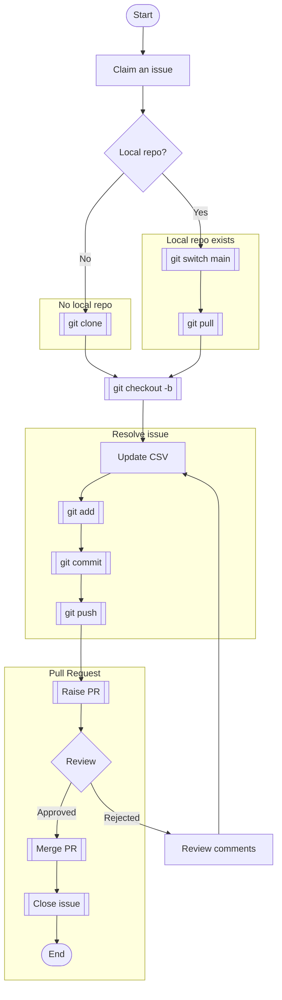

# FSR qualification
This repository contains FAIR Supporting Resources (FSRs) and FAIR Enabling Resources (FERs) 
that are in a qualification workflow or have been qualified (or rejected).

## Workflow

The basic workflow is:

1. Open an issue
2. Get the latest version
3. Modify the CSV accordingly
4. Push your change
5. Raise a Pull Request

When you submit the PR, ensure that the description references the issue number, e.g. `Resolves #12` (for syntax help please see this [article](https://docs.github.com/en/issues/tracking-your-work-with-issues/linking-a-pull-request-to-an-issue)).

